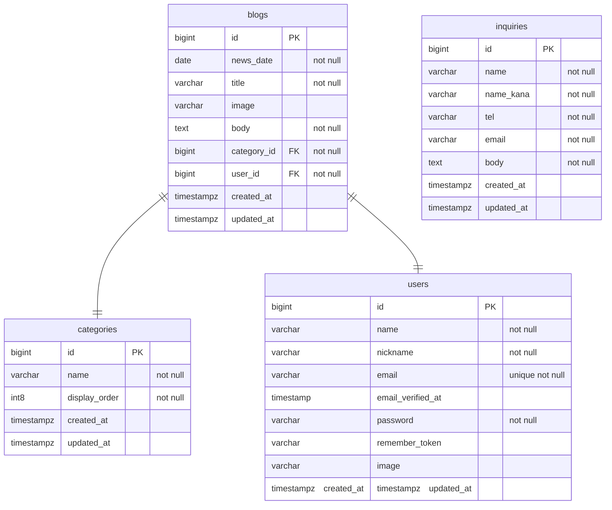

## みんなの外遊びニュース

---

### 1. WEBサービス概要

サービス名

    みんなの外遊びニュース

サービスについて

    当サービスはポートフォリオサイトとして作成しております。
    アウトドア情報のニュースを一般ユーザーに配信するサービスです。
    サービス提供者はログインする事で管理画面からニュースの投稿、
    アカウント管理、お問い合わせ管理などの機能を利用できます。

サービスURL  

[ユーザ画面](https://greentrees.sakura.ne.jp/outdoor_news)
[管理画面<要ログイン>](https://greentrees.sakura.ne.jp/outdoor_news/dashboard)

---
### 2.機能一覧

- アウトドア記事閲覧
- 同カテゴリー記事自動表示
- ページネーション
- カテゴリー検索
- お問い合わせ
- 【管理者機能】ログイン認証
- 【管理者機能】投稿者の記事一覧（管理者トップページ）
- 【管理者機能】アカウント情報（新規・修正・削除）
- 【管理者機能】アウトドア記事投稿（新規・修正・削除）
- 【管理者機能】お問い合わせ一覧（閲覧）

---

### 3. ご利用方法

<u>ご利用にあたって</u>

   「ニュース投稿（画像投稿）」、「アカウント管理」、「お問い合わせ内容の閲覧」を行う場合は管理画面へログインが必要です。

> [!IMPORTANT]
> 当サービスはあくまで個人的なポートフォリオサイトになるので、個人情報を収集しない理念の元、作成しております。
> 管理画面よりアカウント登録が行えますが、**名前、Eメールなどには実際のものは使用しない様お願い致します。**

#### ログインアカウント ####

  デモユーザーを１０ユーザー作成してありますのでこの中からご利用ください。

| 名前     | Email            | パスワード   |
| :------: | :-------------- | :----------: |
| 保下 太郎 | `taro@example.com` | 12345678    |
| 帆下 次郎 | `jiro@example.com` | 12345678    |
| 穂外 三郎 | `saburo@example.com` | 12345678    |
| 歩外 四郎 | `siro@example.com` | 12345678    |
| 捕夏 五郎 | `goro@example.com` | 12345678    |
| 場亜 花子 | `hanako@example.com` | 12345678    |
| 馬亜 春子 | `haruko@example.com` | 12345678    |
| 芭阿 夏子 | `natuko@example.com` | 12345678    |
| 場阿 秋子 | `akiko@example.com` | 12345678    |
| 葉唖 冬子 | `fuyuko@example.com` | 12345678    |

---
### 4.使用技術一覧

| 種類           | 使用技術                                 |
| :------------- | :-------------------------------------- |
| フロントエンド | Livewire、JaveScript、Tailwind CSS        |
| バックエンド   | Laravel(11.13.0)、PHP(8.3.8)             |
| DB            | MySQL                                    |
| 認証          | Laravel Breeze                            |
| ホスティング   | さくらレンタルサーバー                      |
| その他        | laravel-breadcrumbs                       |

---

### 5.ER図

